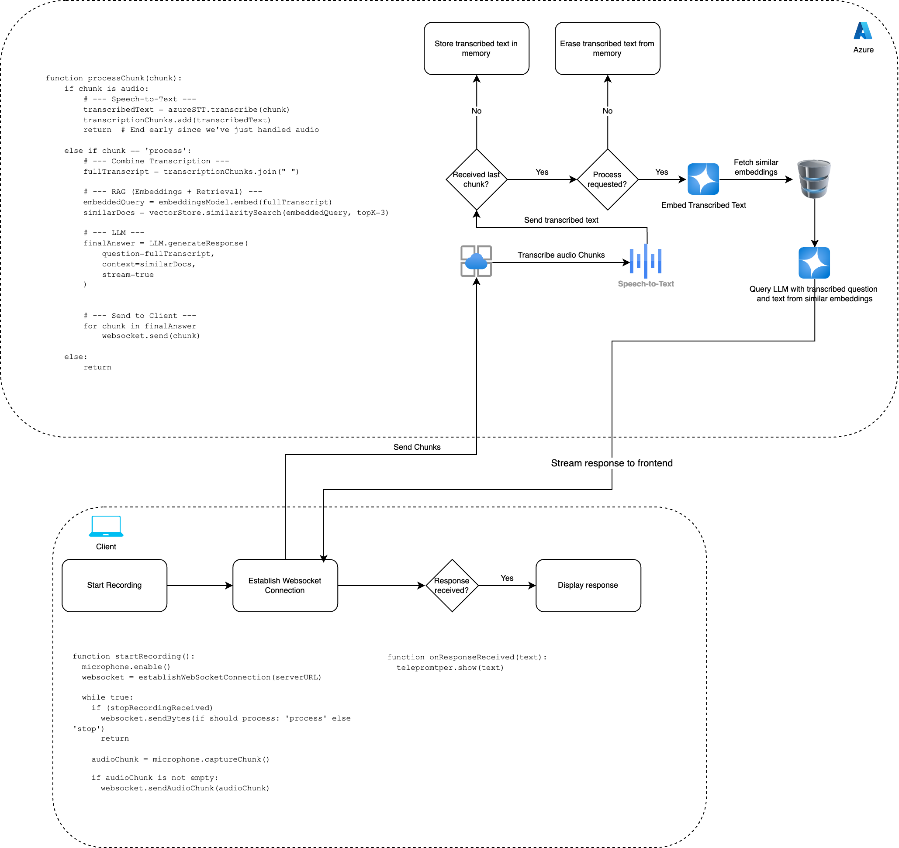

# Live Question-Answering Assistant Backend

This backend application powers the Live Question-Answering Assistant system, processing audio inputs, managing the knowledge base, and generating AI-powered responses.

## Features

- Real-time audio transcription (speech-to-text)
- Knowledge base management with Pinecone vector database
- Retrieval-Augmented Generation (RAG) for informed responses
- Text-to-speech conversion for audio responses
- WebSocket support for real-time communication
- FastAPI-based REST API for managing knowledge files

## Technologies Used

- Python 3.9+
- FastAPI
- Pinecone (vector database)
- WebSockets
- Azure Cognitive Services Speech SDK
- OpenAI/GPT integration

## Prerequisites

- Python 3.9 or higher
- Virtual environment (recommended)
- Azure Cognitive Services account for speech services
- Pinecone account for vector database
- OpenAI API key

## Getting Started

1. **Set up a virtual environment**

```bash
cd backend
python -m venv venv

# On Windows
venv\Scripts\activate

# On macOS/Linux
source venv/bin/activate
```

2. **Install dependencies**

```bash
pip install -r requirements.txt
```

3. **Configure environment variables**

Create a `.env` file in the backend directory with the following variables:

```
OPENAI_API_KEY=your_openai_api_key
PINECONE_API_KEY=your_pinecone_api_key
PINECONE_ENVIRONMENT=your_pinecone_environment
PINECONE_INDEX_NAME=your_index_name
AZURE_SPEECH_KEY=your_azure_speech_key
AZURE_SPEECH_REGION=your_azure_region
```

4. **Start the server**

```bash
uvicorn main:app --reload
```

The server will start at http://localhost:8000.

## API Endpoints

- `GET /` - Root endpoint, serves the main HTML page
- `POST /upload-knowledge-files/` - Upload files to the knowledge base
- `GET /knowledge-files/` - List all files in the knowledge base
- `DELETE /knowledge-files/{filename}` - Delete a file from the knowledge base
- `WebSocket /ws/transcribe` - WebSocket endpoint for real-time audio transcription and responses

## Project Structure

- `app/` - Application modules
  - `services/` - Service modules for transcription, RAG, etc.
- `knowledge/` - Storage for knowledge base files
- `static/` - Static files
- `main.py` - FastAPI application entry point
- `requirements.txt` - Python dependencies

## Knowledge Base Management

You can upload PDF files and other documents to build your knowledge base. These files are processed and stored in Pinecone's vector database for efficient retrieval during question answering.

## How It Works



The system operates through the following steps:

1. The frontend captures audio and sends it to the backend via WebSocket
2. The backend transcribes the audio using Azure's speech services
3. The transcribed question is used to query the Pinecone vector database
4. Relevant information is retrieved from the knowledge base
5. The question and retrieved context are sent to GPT to generate an answer
6. The answer is converted to speech and sent back to the frontend
7. The frontend plays the audio response

## Troubleshooting

- If you encounter WebSocket connection issues, ensure you don't have firewall restrictions
- For Azure speech service errors, verify your API keys and region settings
- If Pinecone isn't responding, check your API key and index configuration
- Memory issues might occur with large knowledge bases - consider adjusting chunk sizes